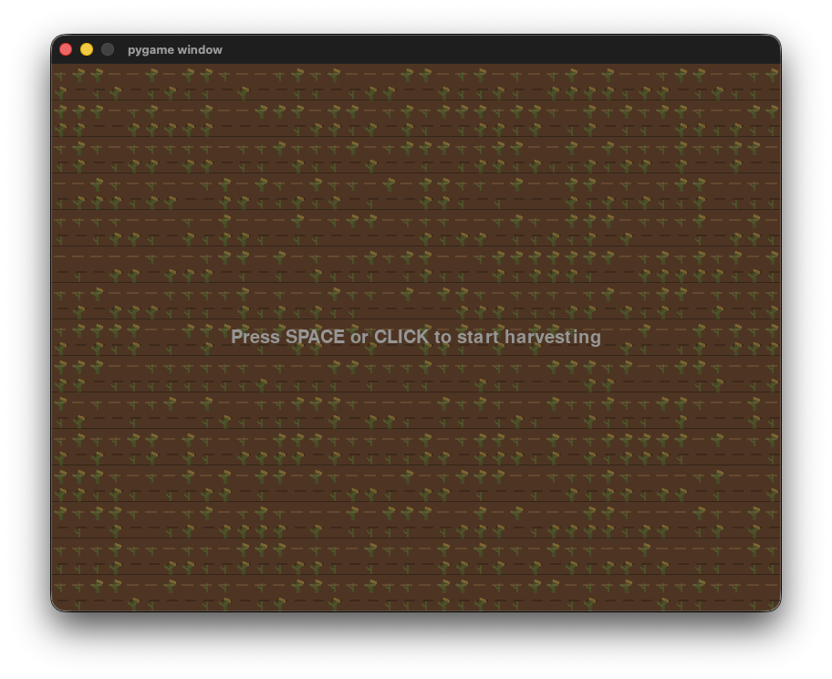
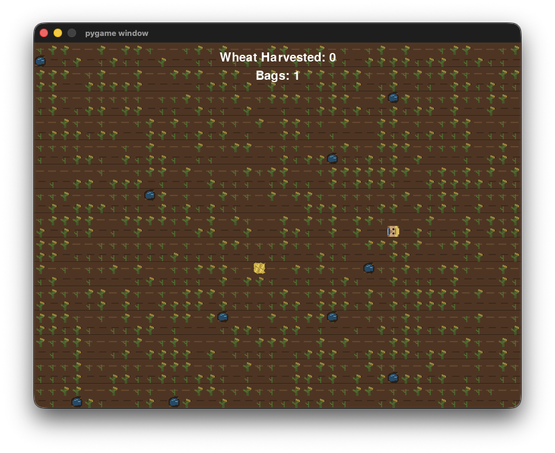
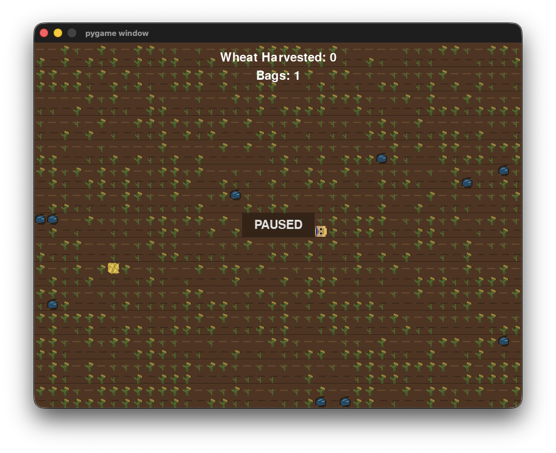
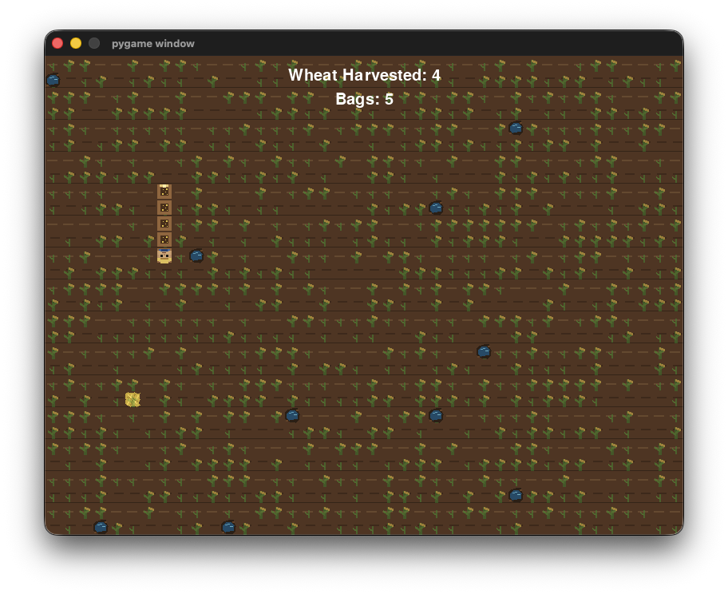
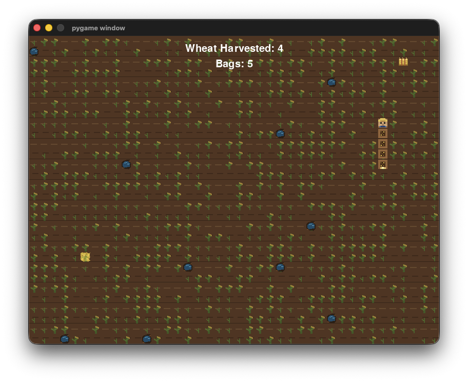
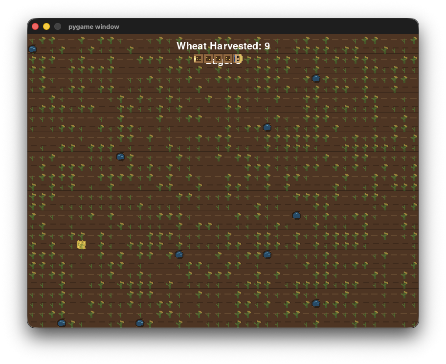
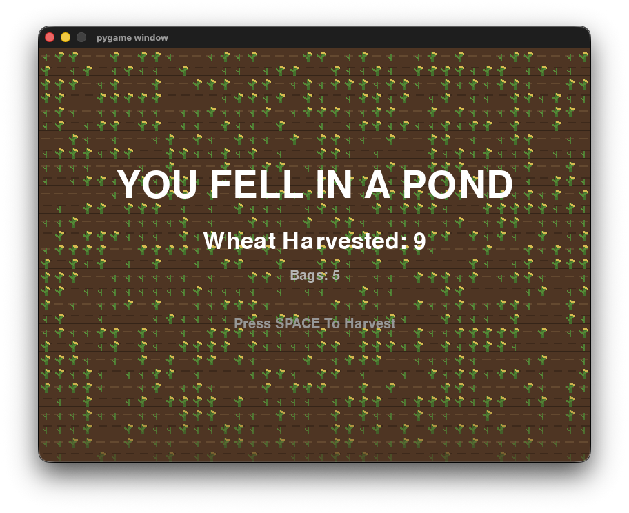

# Farmrush


> A fast-paced farm-themed arcade game built with Python, Pygame, and Pygbag.

[View Source](https://github.com/Haricharan97/Farmrush/blob/main/Farmrush/main.py) · [Open Demo](https://haricharan97.github.io/Farmrush/)

---

## Table of Contents

[About](#about)  
[Features](#features)  
[How to Play](#how-to-play)  
[Controls](#controls)  
[Gallery](#gallery)  
[Run Locally](#run-locally)

---

## About

Farmrush is a snake-inspired farming arcade game where you control a farmer harvesting wheat across a field.

Each wheat collected increases your score and adds another bag to your trail. Avoid ponds and your own growing trail while trying to survive as the game gets progressively faster.

Farmrush is built with **Python and Pygame** and uses **Pygbag** to run directly in the browser.

---

## Features

- Retro snake style grid movement
- Wheat harvesting and score tracking
- Random pond obstacles
- Bonus collectibles worth extra whears
- Pause and restart system
- Browser support with Pygbag

---

## How to Play

1. Press `SPACE` or click to start.
2. Use the arrow keys to move around the field.
3. Collect wheat to increase your score and bag trail.
4. Collect bonus items for extra points.
5. Avoid ponds and your own trail.
6. Survive for as long as possible.

---

## Controls

`↑` = Move Up  
`↓` = Move Down  
`←` = Move Left  
`→` = Move Right  
`SPACE` = Start / Pause / Resume  
`CLICK` = Start / Resume / Restart  

---

## Gallery

| Start Screen | Gameplay | Paused |
|---|---|---|
|  |  |  |

| Growing Trail | Bonus | Gameplay | Game Over |
|---|---|---|---|
|  |  |  |  |

---

## Run Locally

Install Pygame:

```bash
pip install pygame
```

Run the game:

```bash
python Farmrush/main.py
```

To build the browser version:

```bash
pip install pygbag
python -m pygbag --build Farmrush
```

---

Made with **Python, Pygame, and Pygbag**.

With love ~ **Haricharan & Azmeer** ❤️
